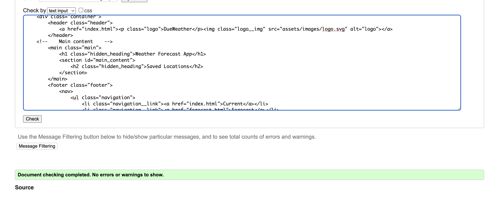

# DueWeather

Due Weather is a comprehensive weather application that not only provides real-time weather updates and forecasts but also allows users to save multiple locations for quick access. The 'Saved' page displays the current weather for each saved location. The application also features a 'Use Your Location' button for more personalized weather information. Additional features include error alerts, a saved location alert, and an hourly forecast for the entire day. Users can also view detailed daily forecasts, including wind speed, sunset and sunrise times, and humidity levels. Saved locations can be easily removed by clicking the trash icon. If no locations are saved, a corresponding message is displayed on the 'Saved' page.

You can view the project [here](https://genaplem.github.io/due_weather).

- - -

## Table of content

- [Description](#dueweather)
- [Table of content](#table-of-content)
- [Features](#features)
   - [Real-Time Weather Updates](#real-time-weather-updates)
   - [Hourly Forecast](#hourly-forecast)
   - [Detailed Daily Forecast Metrics](#detailed-daily-forecast-metrics)
   - [Weather Forecast](#weather-forecast)
   - [Save Your Locations](#save-your-locations)
   - [No Saved Locations Message](#no-saved-locations-message)
   - [Error Alerts](#error-alerts)
   - [Location Saved Alert](#location-saved-alert)
- [Future features](#future-features)
- [Design](#design)
   - [Colors](#colors)
   - [Fonts](#fonts)
   - [Icons](#icons)
   - [Wireframes](#wireframes)
- [Technologies](#technologies)
- [Frameworks, Libraries & Programs](#frameworks-libraries--programs)
- [Testing](#testing)
   - [HTML validation](#html-validation)
   - [CSS validation](#css-validation)
   - [JS validation](#js-validation)
   - [Lighthouse](#lighthouse)
   - [Manual testing](#manual-testing)
   - [Known bugs](#known-bugs)
   - [Encountered Issues](#encountered-issues-during-development)
- [Deployment and local development](#deployment-and-local-development)
   - [Local Development](#local-development)
   - [Deployment](#deployment-to-github-pages)
- [Credits](#credits)
   - [Acknowledgements](#acknowledgements)
   - [Media and Content](#media-and-content)

- - -

## Features

### Real-Time Weather Updates

Simply enter your location in the search bar or use the "Use Your Location" button to automatically fetch weather data based on your current geographical location. DueWeather will display the current weather conditions, including temperature, humidity, wind speed, and more.

### Hourly Forecast

In addition to the current weather conditions, DueWeather also provides an hourly forecast for the entire day. This allows you to plan your day with even more precision, knowing how the weather will change every 3 hour from 9 AM to 9 PM.

### Detailed Daily Forecast Metrics

In the current weather section, you can also view detailed metrics such as wind speed, sunset and sunrise times, and humidity levels. This gives you a more comprehensive understanding of the day's weather conditions.

### Weather Forecast

Not only can you see the current weather, but you can also get a forecast for the next few days. This feature helps you plan your activities better, knowing what kind of weather to expect.

### Save Your Locations

One of the standout features of DueWeather is the ability to save multiple locations. Once saved, you can easily view the current weather conditions for each of these locations on the "Saved" page. This feature is particularly useful for people who travel frequently or have loved ones in different parts of the world.
You can easily remove any saved locations by clicking the trash bin icon next to the location name on the "Saved" page. This gives you full control over the locations you want to keep track of.

### No Saved Locations Message

If you haven't saved any locations yet, the "Saved" page will display a message indicating that no locations have been saved. This ensures that users are aware of the need to save locations to utilize this feature fully.

### Error Alerts

DueWeather is designed to be user-friendly and informative. If an error occurs, such as an invalid location input, the application will display an alert to inform you of the issue, allowing you to correct it easily.

### Location Saved Alert

When you save a location, DueWeather will display an alert to confirm that the location has been successfully saved to your "Saved" page.

- - -

## Future features

As DueWeather continues to evolve, several exciting features are planned to enhance the user experience and functionality:

* ***Autocomplete in Search.***  
To enhance the user experience, an autocomplete feature will be implemented in the search bar. As users begin typing, suggestions for locations will appear, allowing for quicker and more accurate location selection. This feature aims to reduce user effort and minimize errors in choosing a location.

* ***Dynamic Theme Switching.***  
To further personalize the user experience, DueWeather will feature dynamic theme switching based on the local time of the currently displayed location. If the local time is during daylight hours, a light theme will be applied; conversely, a dark theme will be activated during nighttime. This automatic theme switching aims to align the app's appearance with the user's local environment, enhancing usability and aesthetic appeal.

* ***Save Location Icon Feedback.***  
To provide clearer feedback to users, the "Save Location" icon will dynamically change to indicate the current state of the location. Upon saving a location, the icon will transform into a "Saved" state icon, visually confirming that the location has been successfully added to the user's saved locations. This feature aims to eliminate any ambiguity and enhance the user's confidence in using the save functionality.

* ***Custom Location Permission Dialog.***  
To maintain a consistent and polished user interface, the default browser confirmation dialog for accessing the user's current location will be replaced with a custom dialog box. This custom dialog will align with the overall design and theme of DueWeather, providing a more integrated and visually pleasing experience when requesting location permissions.

* ***Custom Weather Icons.***  
  To achieve a unified and custom aesthetic that aligns with the original design plans in Figma, the default weather icons provided by the API will be replaced with custom icons. These new icons will not only enhance the visual appeal of DueWeather but also offer a more cohesive user experience by maintaining design consistency throughout the application.

- - -

## Design

### Colors

* ***Primary Color: Blue (#16AFF0)***  
The primary color for DueWeather is a vibrant shade of blue, represented by the hex code #16AFF0. This color was carefully selected using the Anywhere Picker plugin in Figma, utilizing its color picker tool. The blue hue not only adds visual appeal but also aligns with the theme of weather, evoking feelings of clear skies and tranquility.

* ***Background Gradient***  
Initially, the background was a solid color, but it was later evolved into a gradient to add depth and visual interest. The gradient combines the primary blue color with a shade representing sunlight, which was researched online. This gradient enhances the user experience by creating a more dynamic and visually pleasing interface.

* ***Text and Icons Colors***  
In the initial design, the color of the text and other elements was white. However, during the development process, it was changed to black to improve readability. This change was made to ensure that the text stands out clearly against the background, making it easier for users to interact with the application.

* ***Glassmorphism and Shadows***  
  All elements in the DueWeather project are designed using the Glassmorphism effect. This design trend uses frosted glass-like elements with a blurred background, adding a layer of depth and modernity to the user interface.  
  In addition to the Glassmorphism effect, shadows have been applied to the elements to further enhance their three-dimensionality. The use of shadows adds an extra layer of depth, making the elements pop out more and providing a richer user experience.

### Fonts

* ***Quicksand:***  
The sole font used in the DueWeather project is Quicksand, sourced from Google Fonts. This font was chosen for its clean and modern aesthetic, which complements the overall design of the application. Quicksand has been downloaded and installed locally within the project to ensure it loads efficiently, providing a seamless user experience.

### Icons

* ***API-Generated Icons:***  
While the initial design included custom icons for weather conditions, the decision was made to use the icons provided by the Weather API during the development phase. This choice was influenced by the fact that the API can return a wide variety of "condition text" for the weather, making it challenging to account for all possible scenarios with custom icons.

* ***Future Development:***  
As noted in the "Future Features" section, there are plans to replace these API-generated icons with custom icons to better align with the project's design aesthetic. This will be undertaken once a comprehensive list of all possible "condition text" values is compiled and understood.

### Wireframes

* ***Initial Design in Figma:***  
The initial wireframes for this project were created using Figma. These served as a rough sketch and provided a foundational structure for the project. Below is a screenshot of the initial design.

* ***Design Evolution:***  
While the Figma wireframes were instrumental in shaping the project, many design elements were refined and improved during the actual development process. This iterative approach allowed for more flexibility and resulted in a more polished final product.

- - -

## Technologies

* [HTML](https://en.wikipedia.org/wiki/HTML5)
* [CSS](https://en.wikipedia.org/wiki/CSS)
* [JavaScript](https://en.wikipedia.org/wiki/JavaScript)

- - -

## Frameworks, Libraries & Programs

* [Git](https://git-scm.com/download/mac)
  * for version control.
* [Github](https://github.com/)
  * for storing the project and deployment.
* [WebStorm](https://www.jetbrains.com/webstorm/)
  * IDE for coding.
* [WeatherAPI](https://www.weatherapi.com/)
  * to get weather data
* [Figma](https://www.figma.com/)
  * for wireframes and design.
* [Google fonts](https://fonts.google.com/)
  * for downloading fonts.
* [Icon-icons](https://icon-icons.com/)
  * for icon for the browser tab.
* [Nounproject](https://thenounproject.com/)
  * for icons of weather.
* [Am i Responsive](https://ui.dev/amiresponsive)
  * for mockup in readme.

- - -

## Testing

### HTML validation

  
No errors found on "main" page with W3C validator 

  
  

  
No errors found on "forecast" page with W3C validator 

  

  
No errors found on "saved" page with W3C validator 

  

### CSS validation

  
No errors found with W3C. 

  
  

### JS validation

No warnings/errors found for 'main.js' with JSHint. 

  
  

No warnings/errors found for 'forecast.js' with JSHint. 

  
  

No warnings/errors found for 'saved.js' with JSHint. 

  
  

### Lighthouse 

Achieved a great score of accessibility, performance, best practices, and SEO categories in both mobile and desktop versions for all pages.

  
Main page mobile version:

  

  
Main page desktop version:

  
Forecast page mobile version:

  
Forecast page desktop version:

  
Saved page mobile version:

  
Saved page desktop version:

### Manual Testing
The Due Weather application underwent extensive testing to ensure its compatibility, functionality, and user experience across various scenarios:

* ***Operating Systems:***  
The application was tested on multiple operating systems, including Windows and macOS, to ensure cross-OS compatibility.

* ***Devices:***  
Testing was conducted on a range of devices, such as desktop computers, laptops, tablets, and mobile phones, to guarantee a responsive and adaptive user interface.

* ***Browser Compatibility:***  
The application's compatibility was verified across multiple web browsers, including Google Chrome, Safari, and Firefox. This ensured that users would have a consistent experience regardless of their browser choice.

* ***API Integration:***  
The Weather API's responses were tested for both accuracy and speed. This included validating the search functionality, saved locations, and hourly forecasts.

* ***Page Loading:***  
Loading times were measured for the initial load and for subsequent API calls to ensure a smooth and quick user experience.

* ***Error Alerts:***  
Error handling was tested by simulating incorrect or empty search queries, as well as by disabling location permissions. Alerts were confirmed to display appropriate messages.

* ***Saved Locations:***  
The functionality for saving, displaying, and deleting saved locations was thoroughly tested.

### Known bugs

* ***Save Button Visual Feedback:***  
After a location is saved, the "Save" button does not provide visual feedback to indicate that the location has been successfully saved. While an alert notification does appear to confirm the action, enhancing the button with a visual cue, such as filling it with a solid color, would improve user experience. This feature is planned for a future update and is listed under "Future Features."

* ***Error Notification Timing:***  
When multiple unsuccessful location search attempts are made in quick succession, the error notification starts to appear and disappear more quickly than intended. This issue resolves itself if the user stops interacting with the search function for a short period.

### Encountered Issues During Development

* **Cross-Browser Compatibility**  

   * ***Safari Buttons Text Visibility:***   
Despite using the `content-visibility: hidden;` CSS property, the text inside buttons was still visible on Safari. **This issue was resolved** by setting the text `color: transparent;`  

  * ***Favicon Display Issue in Safari:***  
  The original favicon, which was in SVG format, was not displaying correctly in Safari. Attempts to convert the SVG to other formats like ICO and PNG using `bash` commands  
  `convert logo.svg logo.png`  
  and `convert logo.svg logo.ico`  
  did not resolve the issue. The problem was ultimately solved by downloading the icon in PNG format from [icon-icons](https://icon-icons.com/)

* ***Location Delete Issue:***  
Initially, locations were being compared by their names to delete them from the Local Storage. This approach had limitations and could lead to incorrect deletions. The issue was resolved by assigning a unique id to each saved location. The deletion function was then updated to filter based on this id, ensuring accurate and efficient removal of locations.

* ***Debugging:***  
Encountered issues with asynchronous functions and had to spend a considerable amount of time debugging.

* ***Design Decisions:***  
Initially had a different design in mind but had to adapt due to limitations in the available technology and time constraints.

- - -

## Deployment and local development

### Local Development

To start working on the DueWeather project locally, follow these steps:
1. **Clone the Repository:** Clone the GitHub repository to your local machine using the following command in your terminal:  
   `git clone https://github.com/GenaPlem/due_weather.git`
2. Navigate to the Project Directory: Change to the project directory: 
   `cd due_weather`
3. **Open in a Code Editor:** Use your preferred code editor to open the project files.
4. **Make Changes:** Edit and customize the files according to your requirements.
5. **Test Locally:** Open the HTML files in a web browser to preview the changes locally.

### Deployment to GitHub Pages

Once you've made the desired changes and tested them locally, you can deploy the project to GitHub Pages. Here's how:
1. **Create a GitHub Repository:** If you haven't already, create a repository for your project on GitHub.
2. **Push Changes:** Commit and push your changes to the GitHub repository: 
   `git add .` 
   `git commit -m "Your commit message"` 
   `git push origin main`
3. **Access Repository Settings:** Go to the GitHub repository's settings.
4. **GitHub Pages Section:** Scroll down to the "GitHub Pages" section.
5. **Source Selection:** From the dropdown menu under "Source," choose "main" or "master" as the branch you want to deploy.
6. **Save:** Click the "Save" button.
7. **Deployment:** After a few moments, your site will be deployed to a URL like https://GenaPlem.github.io/due_weather/.

- - -

## Credits

### Acknowledgements

Grateful for the guidance and mentorship provided by [Mitko Bachvarov](https://github.com/MitkoBachvarov), for his support and thorough reviews throughout the development process.

Also thanks to my substitute mentor **Aleksei Konovalov** for his assistance at the beginning of this project. His support and constructive discussions were crucial in shaping the direction of this work.

### Media and Content

* **[WeatherAPI](https://www.weatherapi.com/)**  
  Special thanks to WeatherAPI for providing real-time weather data that powers the core functionality of this application. Their reliable and comprehensive API made it possible to deliver accurate weather forecasts and current conditions to our users. The service is free to use and has been instrumental in the development of this project.

* [Icon-icons](https://icon-icons.com/) icon for browser tab

* [Nounproject](https://thenounproject.com/) icons of wind, sunset, sunrise etc.

- - -